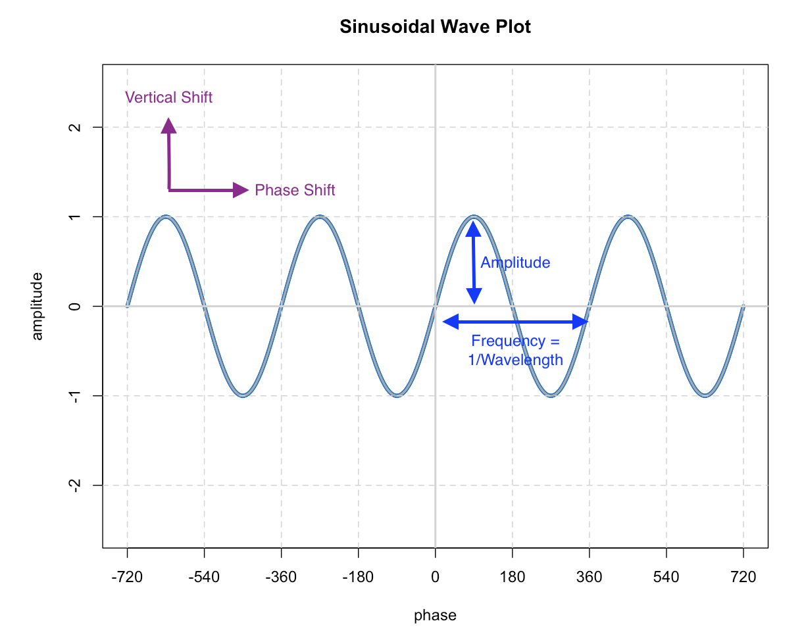
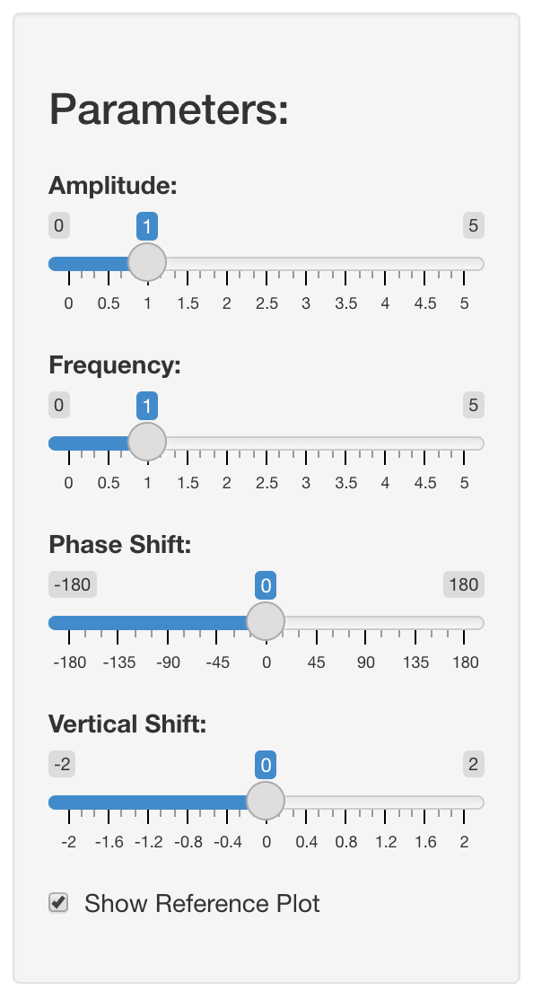

```{r setup, include=FALSE}
knitr::opts_chunk$set(echo = FALSE)
```

## Overview

This project developed an app which allows the user to explore Sinusoidal Wave plotting by varying four parameters.  The rest of this presentation sets out how to use the app.

The app is produced using R Shiny and is hosted here: https://chrisn267.shinyapps.io/sinusoidal_waves

This user guide is written in R Markdown and is published here: https://rpubs.com/chris_nightingale/914220

This work was produced by Chris Nightingale as the final submission for Developing Data Products - the ninth module in the John Hopkins University Data Science Specialisation.


## Form of a Sine Wave

A Sinusoidal (Sine) Wave takes the following form:

**y = Amp * sin(Freq (x - PS)) + VS**

where:

- Amp = Amplitude, the height of the wave
- Freq = Frequency, the number of waves in a period
- PS = Phase Shift, a right/left shift of a wave phase
- VS = Vertical Shift, an up/down shift of the wave

## Plotting a Sine Wave

In this application this gets plotted as below (note that phasing is in degrees rather than radians). 

```{r out.width = "70%", fig.align = "center"}

```

## Adjusting Parameters

<div class="columns-2">

```{r out.width = "50%", fig.align = "center"}

```

Parameters can be adjusted on the app using the control panel.  

The four parameters described on slide 3 have slider input bars to set their values.  

A reference Sine wave can be included on the plot by clicking the checkbox.

</div>

